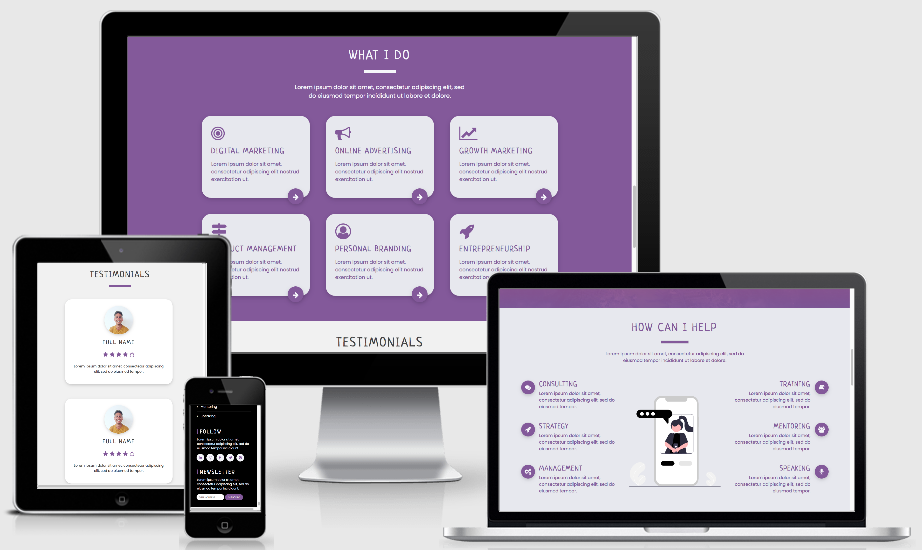

# **[Effie Manyos Personal Website](https://ruszkipista.github.io/cims01-lkc/)**

Static website to promote my services, increase my online presence and build a solid personal branding. This project is the first milestone in obtaining a [Full Stack Web Development](https://codeinstitute.net/full-stack-software-development-diploma/) diploma from [Code Institute](https://codeinstitute.net/).

# **Content**  

[1. UX Design](# "1. UX Design")

 - [1.1. Strategy Plane](# "1.1. Strategy Plane")

 - [1.2. Scope Plane](# "1.2. Scope Plane")

 - [1.3. Structure Plane](# "1.3. Structure Plane")

 - [1.4. Skeleton Plane](# "1.4. Skeleton Plane")

 - [1.5. Surface Plane](# "1.5. Surface Plane")

[2. Features](# "2. Features")

 - [2.1. Existing Features](# "2.1. Existing Features")

 - [1.6. Future Features](# "1.6. Future Features")

# **UX Design**  

## **1.1. Strategy Plane** 
Concerned with what are we aiming to achieve in the first place and for whom? Represents the business goals, the initial idea, why you want to build that product in the first place? 

- Focus → What's worth doing?
- Definition → What are We creating?
- Value → What value does it provide?

### **Target Audience:**
- Entrepreneurs/Solopreneurs
- Tech Startups (Low Budget)
- SMEs (Low Budget)
- Non-Profits
- Mentees
- Entry-Level Professionals
- Recent Graduates

**Countries:** Ireland (Residence), Spain (Nationality), Peru (Origin)

**Age:** Not Specified (Yet)

### **User Needs:**
- **Lack of in-house professionals** with enough experience or knowledge in an specific field.
- **Lack of knowledge** in an specific field.
- **Lack of budget** to outsource certain tasks.
- **Lack of time** to invest in the managment of certain tasks.
- **Lack of clarity** in the overall strategy or even the ultimate goal of certain field.
- **Lack of ideas** on how to grow a business under a tight budget.
- **Lack of structure** in our processes which lead us to negative outcomes. 

### **What are they looking for?**
- Consulting
- Training
- Strategy
- Management
- Guidance
- Clarity
- Structure
- Mentoring
- Speaking
- Knowledge (Develop Technical Skills)
- Collaboration
- Partnership
- Free Resources (+Recommendations)
- Networking

All this list sums up to → **GROW/LAUNCH** their businesses or **GROW** professionally!

### **Site Owner's Goals (Business Goals):**
- Build my personal branding
- Develop a professional online presence
- Expand my networking opportunities
- Promote my services
- Showcase my work (portfolio)
- Get more interesting side projects
- Increase collaborations and partnerships
- Make my knowledge profitable (sell my courses/workshops)
- Increase my client base
- Become thought leader in Cork, then Ireland
- Help people grow their businesses
- Support Irish economy by helping boost the # of Irish startups
- Gain more professional experience in Ireland

### **External User's Goals:**
- Find resources to learn and implement
- Find help to grow my business
- Find help to ideate and execute my business idea
- Get more customers without investing too much ($)
- Increase monthly sales and annual profit
- Look for guidance and clarity
- Stay up to day with the latest trends

### **User Stories:**
"As a (type of user), I want to (perfom some task) so that I can (achieve some goal)."
- As an **Entrepreneur/Solopreneur**, I want to **register** to Effie's **online workshop** so that I can boost my business' monthly sales (achieve some goal).
- As a **Tech Startup**, I want to **use** Effie's **free resources** so that we can create a robust Digital Marketing strategy.
- As a **SME**, I want to **book** a **free consultaiton** with Effie so that we can increase my business' online presence and engagement. 
- As a **Non-Profits**, I want to **contact** Effie for a **collaboration** and **consulting** so that we can grow the organization organically.  
- As a **Mentee**, I want to **apply** too her **mentorship program** so that I can get the proper guidance for my professional career.
- As an **Entry-Level Professional**, I want to **join** the **networking community** so that I can land my first full-time job faster.
- As a **Recent Graduate**, I want to **consume** Effie's **free training resources** so that I can launch my business idea.

These are just some of the user stories I created for this projetc. 

### **USP / Core Differentiators:**

<ins>**Service:**</ins> 
- International experience working at tech startups, SMEs, and multinational corporations.
- International studies in various fields such as Marketing, Advertising, Business, Entrepreneurship, Product Management, Software Development.
- Vast experience working in multicultural teams both in English and Spanish.
- Experience mentoring and training individuals and small groups of people from different age ranges. 
- Speak fluently two of the most spoken languages in the world, Spanish and English.
- Have a deep passion for helping others succeed while growing personally and professionally during that proccess.
- Always up to date with the latest tools and methods in the mentioned fields.
- Open-minded professional who can easily adapt to each individual or organization's way of doing things.
- Data-driven, results-oriented, and customer-obssesed professional.
- Always resourceful and creative, with a lovely sense of humor, loads of patience and positive energy.

<ins>**Website Functionality:**</ins>
- Immediate Response (Chatbot)
- User-friendly
- 100% Responsive
- Free Resources
- Networking Opportunities
- Recommended Partners Section
- Connected to Slack Communities (NetCork & Huasi)
- Notify Me by Email (Events, News, Resources)
- Login/Logout
- Membership Options (Monthly/Annual Subscription)

## **1.2. Scope Plane** 

Concerned with requirements and functional specifications. What features, based on the info from the strategy plane (based on the business goals, objectives, the idea and the reason behind the product's existences), do you want to include in the design? What's on the table for a production release and what's not, at least for now? 

### **Existing Features (MVP):**
- Social Media Links
- Contact Us Form
- Address & Contact Information
- Services
- Studies
- Work Experience
- Communities

### **Future Features (Future Iterations):**
- Chatbot
- Blog
- Resources
- Login/Logout
- Instagram Feed
- Registration Forms (Events, Workshops...)
- Newsletter Form
- Membership Plans & Pricing
- News & Events
- Partnerships & Collaborations
- Welcome Video
- Featured In/Partners
- Key Figures
- Link Form to Webserver (Data Collection)
- GDPR Compliance Cookies Policy
- Calendly Integration ("Book a Call")
- 

## **1.3. Structure Plane** 

How is the information structured and how is it logically grouped, the features, the elements, the data, the information?  It's concerned with categories of information and addresses the way information is presented, how the information is organized.

## **1.4. Skeleton Plane** 

How is

# **Technologies Used** 

The following technology was used during the development and testing of this project:

### **Languages**

- **HTML5** to structure each page.
- **CSS3** to style the elements within each page.

### **Software Development**
- **GitHub** → https://github.com/
- CSS: **CSS Tricks** → https://css-tricks.com/
- CSS/HTML: **W3Schools** → www.w3schools.com

### **Frameworks & Libraries**
- **Bootstrap V4.2.1** → https://getbootstrap.com/

### **Testing**
- Test/Fix Code: **Chrome DevTools** → https://developers.google.com/web/tools/chrome-devtools
- Website Responsiveness: **Responsive viewer** → https://www.producthunt.com/posts/responsive-viewer
- Website Performance: **Google Lighthouse** → https://developers.google.com/web/tools/lighthouse
- Validate HTML: **W3C HTML Validator** → https://validator.w3.org/
- Validate CSS: **W3C CSS Validator** → https://jigsaw.w3.org/css-validator/

### **Other Technology**
- Mockup: **Responsive Design** → http://ami.responsivedesign.is/
- Icons: **Font Awesome V4.7.0** → https://fontawesome.com/v4.7.0/icons/
- Unicode: **Cool Symbol** → https://coolsymbol.com/
- Illustrations: **UnDraw** → https://undraw.co/
- Photography: **Unsplashed** → https://unsplash.com/
- Fonts: **Google Fonts** → https://fonts.google.com/
- Wireframes: **Balsamiq** → https://balsamiq.com/
- Planning: **Miro** → https://miro.com/
- Visuals: **Canva** → https://www.canva.com/
- Colour Scheme: **Coolors** → https://coolors.co/

# **Credits** 

### **Inspiration**
- Sian Horn Website → https://sianhorn.com/
- Dana Fuelles → https://danafuelles.coach/
- Wonsulting → https://wonsulting.com/

### **Media**
- [JCI Ireland](https://www.jciireland.ie/) Logo
- [ThePowerMBA](https://thepowermba.com/) Logo
- [Growth Hacking Course](https://www.growthhackingcourse.io/) Logo
- [Sian Horn | The Club](https://sianhorn.com/) Logo
- [IPMG](https://www.linkedin.com/company/irish-product-management-group/) Logo
- [Product School](https://www.productschool.com/) Logo
- [Product Buds](https://productbuds.co/) Logo
- [Code Institute](https://codeinstitute.net/) Logo
- [Women in Tech](https://women-in-tech.net/) Logo
- [Up She Rises](https://upsherises.ie/) Logo